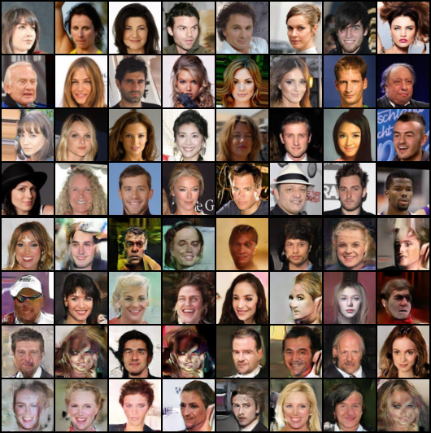

# DCGAN Face Generation

A Deep Convolutional Generative Adversarial Network implementation for generating realistic human faces using the CelebA dataset.

## Overview

This project implements a DCGAN with a generator that creates synthetic facial images and a discriminator that evaluates their authenticity. The adversarial training process improves both networks, resulting in photorealistic face generation.

## Architecture

**Generator**: 4-layer transpose convolutional network (100D noise → 64×64×3 RGB)  
**Discriminator**: 4-layer convolutional network (64×64×3 RGB → binary classification)

## Training Configuration

| Parameter        | Value                    |
| ---------------- | ------------------------ |
| Dataset          | CelebA (200,000+ images) |
| Resolution       | 64×64 pixels             |
| Batch Size       | 128                      |
| Epochs           | 200                      |
| Generator LR     | 1×10⁻⁴                   |
| Discriminator LR | 2×10⁻⁵                   |
| Optimizer        | Adam (β₁=0.5, β₂=0.999)  |

## Results

Peak performance achieved at epoch 150:



_Top: Real images from CelebA dataset | Bottom: Generated images by DCGAN_

## Key Features

- **High-Quality Generation**: Photorealistic facial images
- **Stable Training**: Label smoothing and batch normalization
- **Multi-GPU Support**: DataParallel implementation
- **Progress Tracking**: Visual checkpoints every 10 epochs

## Technical Details

- **Framework**: PyTorch
- **Hardware**: CUDA GPU recommended
- **Training Time**: ~4-6 hours on modern GPU
- **Memory**: 8GB+ VRAM optimal

## Project Structure

```
DCGAN/
├── dcgan-celeba.ipynb    # Training implementation
├── README.md             # Documentation
└── Outputs/              # Training progress images
    └── real_vs_fake_epoch_*.png
```

## License

This project is licensed under the **MIT License**.

---

## About

**Nishanth Devabathini** - AI enthusiast passionate about developing intelligent systems.

- **GitHub**: [Nishanth1812](https://github.com/Nishanth1812)
- **LinkedIn**: [Nishanth Devabathini](https://www.linkedin.com/in/nishanth-devabathini-738a8a212/)

---
